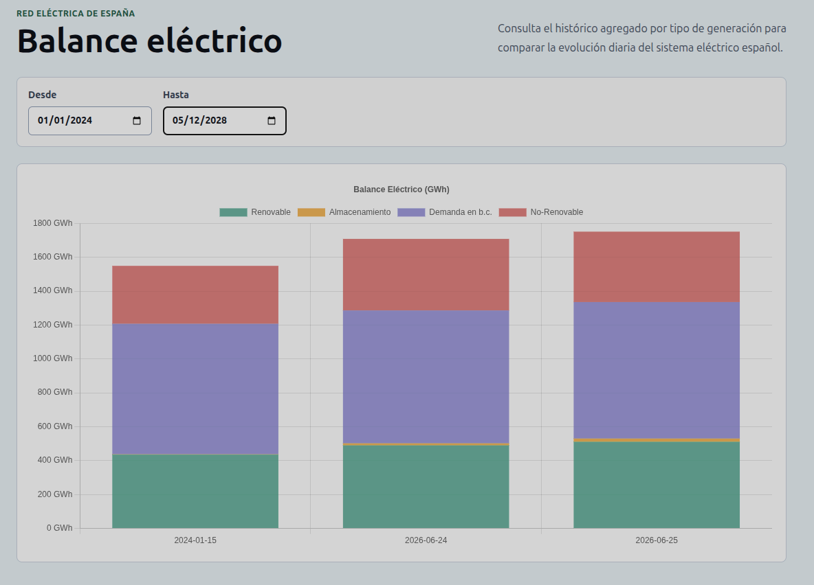

# Primer Impacto — Dashboard de Balance Eléctrico

Dashboard full-stack para visualizar el balance eléctrico de España consumiendo
la API de Red Eléctrica de España (REE). Construido con **Arquitectura Hexagonal**
para mantener el dominio completamente aislado de los frameworks.

## Stack

| Capa | Tecnología |
|---|---|
| Backend | NestJS + TypeScript |
| Base de datos | PostgreSQL 16 |
| ORM | TypeORM |
| Frontend | React + TypeScript + Vite |
| Estilos | Tailwind CSS |
| Gráficos | Chart.js + react-chartjs-2 |
| Estado async | React Query (@tanstack/react-query) |
| Contenedores | Docker + Docker Compose |
| Tests backend | Jest |
| Tests frontend | Vitest + React Testing Library |

## Arquitectura

```
server/src/
├── domain/
│   ├── entities/          # ElectricBalance — lógica pura sin dependencias
│   ├── ports/             # IBalanceRepository, IREEApiClient (interfaces)
│   └── use-cases/         # GetBalanceUseCase, SyncFromREEUseCase
└── infrastructure/
    ├── adapters/
    │   ├── persistence/   # TypeORM entity + repositorio concreto
    │   └── ree/           # Adaptador HTTP para la API de REE
    ├── http/              # BalanceController (rutas REST)
    ├── jobs/              # SyncCronJob (sincronización horaria)
    └── balance.module.ts  # Registro de dependencias NestJS

client/src/
├── features/
│   └── electric-balance/
│       ├── api/           # useBalanceQuery (React Query), balance.client
│       ├── components/    # BalanceChart, BalanceChartSkeleton
│       └── types/         # BalanceEntry DTO
└── shared/
    └── lib/               # Instancia axios configurada
```

El dominio no importa nada de NestJS, TypeORM ni Axios. Las dependencias
siempre apuntan hacia adentro: infraestructura → dominio, nunca al revés.

## Pipeline de datos

1. `SyncCronJob` ejecuta una sincronización cada hora.
2. `SyncFromREEUseCase` solicita a REE el balance diario con
   `start_date`, `end_date` y `time_trunc=day`.
3. `REEApiClientImpl` transforma la respuesta externa al modelo de dominio
   `ElectricBalance`.
4. `BalanceTypeORMRepository` persiste los datos con upsert sobre PostgreSQL.
5. `GET /balance` sirve datos históricos ya almacenados para el frontend.

El endpoint `GET /balance/sync?date=YYYY-MM-DD` permite forzar una
sincronización manual para pruebas o recuperación de datos.

## Modelo de datos

La tabla `electric_balance` guarda una fila por fecha y fuente de balance:

| Campo | Descripción |
|---|---|
| `date` | Día del dato sincronizado |
| `group_id` | Grupo de REE: renovable, no renovable, demanda, etc. |
| `source_id` | Identificador de la tecnología o total |
| `source_name` | Nombre legible de la fuente |
| `is_total` | Indica si la fila representa el total del grupo |
| `value_mwh` | Valor energético en MWh |
| `percentage` | Peso relativo informado por REE |

Existe una restricción única sobre `date + source_id`, por lo que repetir una
sincronización actualiza los datos sin duplicarlos.

## Vista del frontend



## Estructura del proyecto

```
primer-impacto/
├── server/                         # API REST (NestJS)
├── client/                         # SPA (React + Vite)
├── docker-compose.yml              # Servicios base (PostgreSQL)
├── docker-compose.dev.yml          # Overrides desarrollo (hot reload)
├── docker-compose.prod.yml         # Overrides producción (builds optimizados)
└── .env.example                    # Variables de entorno requeridas
```

## Requisitos

- [Docker](https://docs.docker.com/get-docker/) y Docker Compose v2
- Node.js 20+ (solo para desarrollo local sin Docker)

## Configuración inicial

```bash
cp .env.example .env
# Editar .env y cambiar POSTGRES_PASSWORD por un valor seguro
```

## Desarrollo

```bash
docker compose -f docker-compose.yml -f docker-compose.dev.yml up
```

| Servicio | URL |
|---|---|
| Frontend (Vite HMR) | http://localhost:5173 |
| API (NestJS) | http://localhost:3000 |
| Health check | http://localhost:3000/health |
| PostgreSQL | localhost:5432 |

Los cambios en `server/src/` y `client/src/` se reflejan al instante
gracias al hot reload montado como volumen Docker.

### Sincronización manual de datos

```bash
# Sincronizar una fecha concreta desde la API de REE
curl "http://localhost:3000/balance/sync?date=2024-01-15"

# Consultar los datos guardados
curl "http://localhost:3000/balance?from=2024-01-01&to=2024-01-31"
```

## Producción

Antes de levantar en producción, actualizar en `.env`:
```env
NODE_ENV=production
ALLOWED_ORIGIN=http://localhost   # o el dominio real
```

```bash
docker compose -f docker-compose.yml -f docker-compose.prod.yml up --build
```

| Servicio | URL |
|---|---|
| Frontend (Nginx) | http://localhost |
| API (NestJS) | http://localhost:3000 |

## Tests

```bash
# Backend (Jest)
docker compose exec api npm test

# Backend e2e
docker compose exec api npm run test:e2e

# Frontend (Vitest)
docker compose exec client npm test

# También pueden ejecutarse localmente:
cd server && npm test
cd server && npm run test:e2e
cd client && npm test
```

**21 tests automatizados:**
- 5 suites backend unitarias: `SyncFromREEUseCase`, `GetBalanceUseCase`, `BalanceController`, `REEApiClient`, `AppController`
- 1 suite e2e backend: API REST de `/balance`
- 2 suites frontend: `BalanceChart`, `App`

Los tests del dominio no requieren base de datos ni HTTP — usan mocks puros
de `IBalanceRepository` e `IREEApiClient`.

## API REST

| Método | Ruta | Descripción |
|---|---|---|
| `GET` | `/health` | Estado del servidor y conexión a BD |
| `GET` | `/balance?from=YYYY-MM-DD&to=YYYY-MM-DD` | Balance eléctrico por rango de fechas |
| `GET` | `/balance/sync?date=YYYY-MM-DD` | Forzar sincronización con REE |

Las fechas se validan en formato `YYYY-MM-DD`, se rechazan fechas imposibles y
`from` no puede ser posterior a `to`.

## Variables de entorno

| Variable | Descripción |
|---|---|
| `POSTGRES_USER` | Usuario de PostgreSQL |
| `POSTGRES_PASSWORD` | Contraseña de PostgreSQL |
| `POSTGRES_DB` | Nombre de la base de datos |
| `DATABASE_URL` | URL completa de conexión (usada por NestJS) |
| `REE_BASE_URL` | URL base de la API de REE |
| `ALLOWED_ORIGIN` | Origen permitido en CORS (URL del frontend) |
| `VITE_API_URL` | URL de la API consumida por el cliente |

## Decisiones técnicas

- **Upsert idempotente:** constraint `UNIQUE(date, source_id)` en PostgreSQL. El cron job puede ejecutarse N veces sin duplicar datos.
- **Graceful degradation:** si la API de REE falla, el sistema loguea el error y continúa sirviendo los datos ya almacenados.
- **`keepPreviousData` en React Query:** al cambiar el rango de fechas, el gráfico anterior permanece visible mientras carga el nuevo — sin parpadeo.
- **Zonas horarias:** `date-fns-tz` con `Europe/Madrid` para que el cron job sincronice el día correcto según la hora peninsular española.
- **Docker multi-stage:** el backend compila con dependencias de desarrollo en un stage intermedio y ejecuta producción solo con dependencias runtime.
- **TypeORM seguro por entorno:** `synchronize` solo se activa fuera de producción; en un despliegue real se sustituiría por migraciones versionadas.
